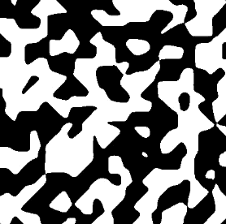
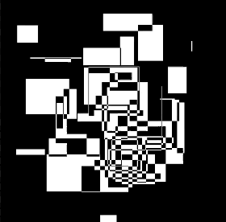
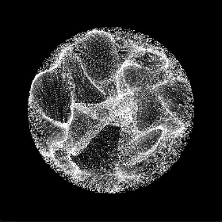
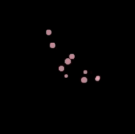
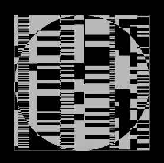
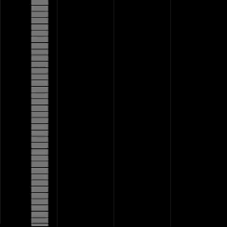

# Adventure is Noiseland

Inspired by the work of [@shiffman](https://twitter.com/shiffman) and [@etiennejcb](https://twitter.com/etiennejcb).

Articles:

- [Drawing from noise](https://necessarydisorder.wordpress.com/2017/11/15/drawing-from-noise-and-then-making-animated-loopy-gifs-from-there/)

| <h3>zebra noise</h3>  | <h3>motion blur</h3>                         |
| --------------------------------------------------------------- | --------------------------------------------------------------------------------------- |
| <h3>xor madness</h3> | <h3>displacement circle</h3> |
| <h3>pink arm</h3>          | <h3>sliding rectangles</h3>    |
| <h3>starfield</h3>       | <h3>bricks</h3>                                 |
